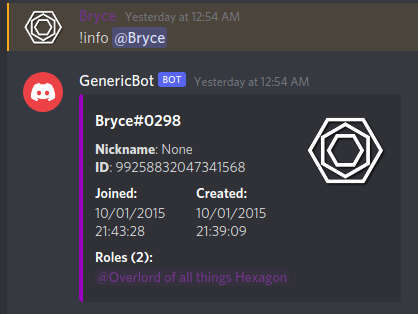

# Discord Bot Tutorial with Python


A Discord bot can make your Discord server come alive. With a custom bot made by you, you can add some entertainment or assist in your moderation duties!

It's also a great way to practice your newly found Python skills!

For this tutorial, we assume that you are using Windows 10, and the example IDE/Editor will be [Visual Studio Code](https://code.visualstudio.com/).

You should also be familiar with Discord and the basics of operating a Discord server.

The following programs are required for this tutorial (You may install them as required, or install them ahead of time):

Program | Download Page
--------|--------------
Python 3.9 | <https://www.python.org/downloads/>
Git | <https://git-scm.com/downloads>
Visual Studio Code | <https://code.visualstudio.com/download>

## Python setup

Install the latest python version (Python 3.9 at time of writing).

1. [Install Python](https://www.python.org/downloads/)
    * When you see the option during installation, click the `Add to PATH` checkbox!

2. Restart your computer for some changes to take effect.

## Git Setup

Create a GitHub repo & clone locally.

1. If not already done, create a [GitHub](https://github.com/) account.

2. [Create a new repository](https://github.com/new) on GitHub and fill out the required fields.

    Dropdown located in the top-right of the GitHub website

    

    

    Click this button after naming your repository:

    

    **Important**: You will be brought to a new page.
    Copy the URL in the box and save it somewhere for later.

    

3. [Install Git](https://git-scm.com/downloads) on your computer.

4. Clone the git repository to your computer

    1. In *File Explorer*, navigate to where you want to store your code. (Desktop, My Documents, etc.)

    2. Open *Powershell* in the current folder by pressing `Shift + Right Click` and selecting "Open Powershell window here".

    3. In Powershell, enter:

        ``` PowerShell
        git clone https://github.com/YourGitHubUsername/RepositoryName
        ```

        * Replace *YourUsername* and *RepositoryName* with the appropriate values.

## IDE Setup

You can access the extensions section from the button on the left side of Visual Studio Code.


### Python Extension

1. Type `python` into the search bar.

    

2. Click the extension published by *Microsoft*. It should be the first in the list of results.

3. Click the blue install button.

### GitLens

1. Type `gitlens` into the search bar.

    

2. Click the extension `GitLens -- Git supercharged` by Eric Amodio. It should be the first in the list of results.

3. Click the blue install button.

### Opening the Project

1. Click on "Open Folder" in the *Welcome* tab of Visual Studio Code. (The tabs are located at the top of the window)

    * If you lost this tab, you can also use the *File* context menu in the top-left to perform this action.

2. Navigate to where the cloned Git repository is located.

3. Click on the folder and hit okay.

### Virtual Environment

1. Open a terminal in Visual Studio Code

2. Create the virtual environment

    * Enter the command: `python -m venv env`

3. Install the required libraries

    * Enter the command: `pip install discord.py`

## Creating the Bot

**Please type the code examples, do not copy and paste them.**

**Indentation in the code is important!**

In Visual Studio Code, create a new file and name it `bot.py`.


### Creating the Bot Class

1. Import the `discord.py` library:

    ``` Python
    import discord # Import discord.py
    ```

2. Create the class for your bot and an *on_ready* method:

    ``` Python
    class MyBot(discord.Client):
        async def on_ready(self): # on_ready method signature
            print(f'Connected to Discord as {self.user}') # on_ready method body
    ```

3. Instantiate the bot

    1. Import the `OS` module, allowing you to get environment variables.

        ``` Python
        import os # This should be at the top of the file, above or below the other import
        ```

    2. Create the bot variable, and pass in your *discord bot token* via an environment variable.

        ``` Python
        # This should be below everything else in the file
        bot = MyBot(command_prefix='!')
        bot.run(os.environ.get('DISCORD_BOT_TOKEN'))
        ```

Your current `bot.py` file should look like:

``` Python
import discord
import os

class MyBot(discord.Client):
    async def on_ready(self):
        print(f'Connected to Discord as {self.user}')


bot = MyBot(command_prefix='!')
bot.run(os.environ.get('DISCORD_BOT_TOKEN'))
```

### Connecting to Discord

1. Register your bot with Discord

    In-order to allow your bot to connect to Discord, you must create the bot user on the [Discord Developer Portal](https://discord.com/developers/).

    1. Create a new application

        1. Click the "New Application" button in the top right of the webpage.

            

        2. Fill in the name of your bot and leave the team as "Personal".

            

        3. Click "Create".

    2. Enable the bot user

        1. On the left side of the page, click the menu item that says "Bot".

        2. Click the blue button on the right which says "Add Bot". (Also click "Yes, do it!" in the confirmation box)

    3. Copy the token on the bot page by clicking the blue "Copy" button.

        * Keep this in a safe place for now! You *will* need it later!

2. Invite the bot to your server

    1. Navigate to the "OAuth2" page from the menu on the left.

    2. Add a redirect URL.
        * It doesn't matter the URL you enter as long as it's valid.

        

    3. Set the redirect URL you just added in the dropdown under "Select Redirect URL".

    4. In the box below that, set the bot scope by clicking the appropriate checkbox.

        

    5. Set the bot's default permissions in the next box.

        * You don't need many permissions for this tutorial.

        

    6. Copy the invite link at the bottom of the "scope" box by clicking the blue "Copy" button on the right.

        

    7. Paste the URL you just copied in a new browser tab's address bar and hit enter.

    8. Allow the bot to join your Discord server

        1. Select the server you want to join from the dropdown.

        2. Click on "Continue".

        3. Click on "Authorize".

        4. If asked, click the verification checkbox.

3. Start the bot

    1. Open a terminal in Visual Studio Code using the keyboard shortcut `CTRL + SHIFT + \``
        * It should appear at the bottom of the screen. You can click on it to begin typing in it.

    2. Run the python program, allowing the bot to connect to Discord.

        * Don't forget to paste your bot token on the first line (where it says *YOUR_TOKEN*)

        ``` CMD
        set DISCORD_BOT_TOKEN=YOUR_TOKEN
        python bot.py
        ```

    You should see it say something similar to `Connected to Discord as BotName#0123` in your terminal. It may take a moment to appear.

    This means your bot has successfully connected to Discord and can interact with your server and its users!

    You can press `CTRL + C` to force the bot to shutdown.

## Adding Commands

Commands are the most basic way for users in your server to interact with your bot.

As you add each command, re-start your bot and test it out!

**Important**: Ensure that the code is typed before `bot.run()` and *after* `bot = MyBot()`

### Ping

A ping command is an easy way for users and yourself to ensure that your bot can read and reply to users' messages.

``` Python
@bot.command() # Links the function to your bot as the logic for the command
async def ping(ctx): # The command name is defined by the function name
    """Check the bot's responsiveness""" # Describes what the command

    await ctx.reply('Pong!') # Send's the message as a reply (notifies them) to the user
```

You can test the command by sending `!ping` into any channel in the Discord server with your bot.

And, __if you feel lost__, here is what you should have so far:

``` Python
import discord
import os

class MyBot(discord.Client):
    async def on_ready(self):
        print('Connected to Discord as {0}'.format(self.user))


bot = MyBot(command_prefix='!')

@bot.command()
async def ping(ctx):
    """Check the bot's responsiveness"""

    await ctx.reply('Pong!')


bot.run(os.environ.get('DISCORD_BOT_TOKEN'))
```

### Compliment

We're going to introduce user input into your bot's commands.

This command will take in a user in your server and respond with a random compliment from a list.

1. Create a list of compliments for the bot to select from

    * This should be below the ping command, but above `bot.run()`

    ``` Python
    compliments = [
        '{} has a great sense of humor!',
        '{} is awesome!',
        '{} is even more beautiful on the inside than on the outside.',
        '{} is an inspiration to us all.',
        '{} is like a ray of sunshine on a dreary day.',
        '{} is okay.'
    ]
    ```

2. Create the compliment command

    ``` Python
    @bot.command()
    async def compliment(ctx, user: discord.Member):
        """Compliments the specified user :)"""

        # Grabs a random item from the list defined earlier, 
        #   and puts in the name of the user specified in the curly brackets.
        compliment = random.choice(compliments).format(user.display_name)
        await ctx.send(compliment)
    ```

3. Add a function to handle any errors

    We need some way for the bot to inform the user that they mistyped the command inputs.

    ``` Python
    @compliment.error
    async def compliment_error(ctx, error):
        if isinstance(error, commands.MissingRequiredArgument):
            # This case handles when there was no user specified.
            await ctx.reply('You need to tell me who to compliment!')
        elif isinstance(error, commands.BadArgument):
            # This case handles the specified user not existing in the current server.
            await ctx.reply('That\'s not a user in this server!')
    ```

You should have ended up typing this:

``` Python
compliments = [
    '{} has a great sense of humor!',
    '{} is awesome!',
    '{} is even more beautiful on the inside than on the outside.',
    '{} is an inspiration to us all.',
    '{} is like a ray of sunshine on a dreary day.',
    '{} is okay.'
]

@bot.command()
async def compliment(ctx, user: discord.Member):
    """Compliments the specified user :)"""

    compliment = random.choice(compliments).format(user.display_name)
    await ctx.send(compliment)

@compliment.error
async def compliment_error(ctx, error):
    if isinstance(error, commands.MissingRequiredArgument):
        await ctx.reply('You need to tell me who to compliment!')
    elif isinstance(error, commands.BadArgument):
        await ctx.reply('That\'s not a user in this server!')
```

Feel free to test the command yourself before moving on!

### User Info



Now you're going to use an embed in your response!

These allow a more advanced formatting for your messages than a normal string provides.

This is a lot of lines, so I will show the entire code, which you should type in, then I will break down the parks.

``` Python
@bot.command()
async def info(ctx, user: discord.Member):
    """Displays information about the specified user in an embed"""

    embed = discord.Embed(
        title=f'{user.name}#{user.discriminator}',
        description=f'''{f'**Nickname**: {user.nick}' if user.nick == None else ''}
        **ID**: {user.id}''',
        color=0x9800BE
    )

    embed.set_thumbnail(url=user.avatar_url)

    jt = user.joined_at
    embed.add_field(name='Joined:', value='{}\n{}'.format(jt.strftime('%m/%d/%Y'), jt.strftime('%H:%M:%S')))

    ct = discord.utils.snowflake_time(user.id)
    embed.add_field(name='Created:', value='{}\n{}'.format(ct.strftime('%m/%d/%Y'), ct.strftime('%H:%M:%S')))

    # Removes the first role in the list, which is @everyone,
    #   and gets their mention strings.
    role_pings = [role.mention for role in user.roles[1:]]

    embed.add_field(name=f'Roles ({len(user.roles)-1}):', value=f'{" ".join(role_pings)}', inline=False)

    await ctx.send(embed=embed)
```

* This part creates the base Embed model and fills in the user's basic information

  * It also defines the color in hexadecimal on the left side of the embed (Purple, in this case)

``` Python
embed = discord.Embed(
        title=f'{user.name}#{user.discriminator}',
        description=f'''{f'**Nickname**: {user.nick}' if user.nick == None else ''}
        **ID**: {user.id}''',
        color=0x9800BE
    )
```

* Here, we set the thumnail to the specified user's avatar

``` Python
embed.set_thumbnail(url=user.avatar_url)
```

* This retrieves and displays when the user joined your server, and when their account was first created

``` Python
jt = user.joined_at
embed.add_field(name='Joined:', value='{}\n{}'.format(jt.strftime('%m/%d/%Y'), jt.strftime('%H:%M:%S')))

ct = discord.utils.snowflake_time(user.id)
embed.add_field(name='Created:', value='{}\n{}'.format(ct.strftime('%m/%d/%Y'), ct.strftime('%H:%M:%S')))
```

* This line turns the list of the user's roles into a list of strings which are their cooresponding role mentions
  * The first role in the list is always removed since it will always be "@everyone"

``` Python
role_pings = [role.mention for role in user.roles[1:]]
```

* Here, we set the title of the field to include the number of roles the user has, then display them in a list

``` Python
embed.add_field(name=f'Roles ({len(user.roles)-1}):', value=f'{" ".join(role_pings)}', inline=False)
```

* Finally, the embed is sent as a message into the Discord channel in which the command originated.

``` Python
await ctx.send(embed=embed)
```

Now you have the basics of making a Discord bot! Congratulations!!

I encourage you to check out the additional resources below and learn more, because there are many many more things you can do beyond this tutorial!

------------------------------------

## Additional Resources

Feel free to browse these resources to learn more on the topics presented in this tutorial!

* [Python Documentation](https://www.python.org/doc/)
  * [Python Tutorial](https://docs.python.org/3/tutorial/index.html)
* [Discord.py Documentation](https://discordpy.readthedocs.io/en/stable/)
* [Discord API Documentation](https://discord.com/developers/docs/intro)
